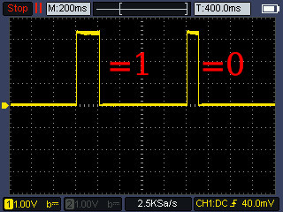
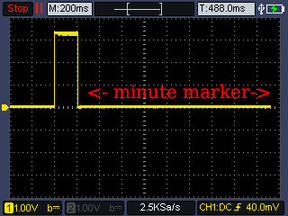
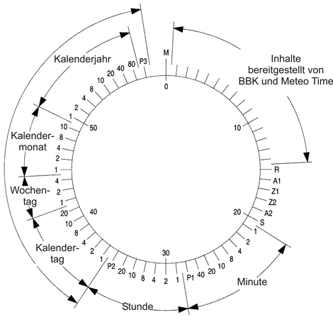
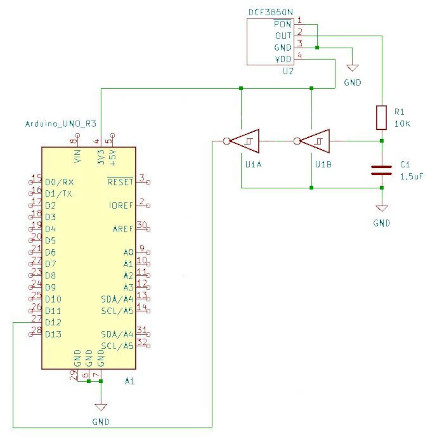

*„Wenn die Realität nur eine Projektion ist, was passiert dann, wenn die Quelle, das Bewusstsein, abwesend ist?“*

# Basic DCF77 decode

This Arduino library implements all bits publicly specified by the „[Physikalisch-Technische Bundesanstalt](https://www.ptb.de/cms/ptb/fachabteilungen/abt4/fb-44/ag-442/verbreitung-der-gesetzlichen-zeit/dcf77/zeitcode.html)“ that are within a 60 second bit stream of the time signal, with the exception of the leap second.
It also checks for transmission errors via even parity and queries the 15 bit ("call bit") to rule out problems with the transmitter.
The focus is on clean code, excellent documentation and ease of use of this library.
The blocking pulseIn() function, which is part of the standard Arduino library, is used for this. There are no other dependencies required.

<div align="center">
<table><tr>
<td>  </td>
<td>  </td>
</tr></table>
</div>

The 200 ms pulse represents a 1 and the 100 ms pulse represents a 0. You can see the pulses in the picture on the left.
In this way, 59 bits can be received in one minute, always containing the current date and time. The 60th pulse is kept low (except for leap seconds). This is shown in the illustration on the right.
It indicates the end of the minute. If you interpret all 59 pulses as a bit sequence, you can decode the meaning of the individual bits using the following figure.

<p align="center">
    
</p>

Image source: [Physikalisch-Technische Bundesanstalt](https://www.ptb.de/cms/ptb/fachabteilungen/abt4/fb-44/ag-442/verbreitung-der-gesetzlichen-zeit/dcf77/zeitcode.html)

Take a look at the following example, this is a complete DCF77 bit string:
```
00111010000010100010110010011100110110010110111000001001001
                     ^^^^^^^
                     |

                     Minutes Bits(21 to 27)
```

The 7 bits relevant for minute decoding are marked. If you start at 0 and count from left to right, the marked range begins at the 21st digit.
If you now relate the meaning of the bits to the graphic above, the following calculation results:

`(1*1)+(0*2)+(0*4)+(1*8)+(0*10)+(0*20)+(1*40)=49`

Applying this principle to the decoding of the hour, you get 19:49


An English documentation about DCF77 can be found [here](https://www.cyber-sciences.com/wp-content/uploads/2019/01/TN-103_DCF77.pdf).

## Hardware Setup

For this library you need DCF77 receiver module that demodulates the AM signal from Frankfurt, Germany.

Please note that in addition to [DCF77](https://de.wikipedia.org/wiki/DCF77) there are other time signal transmitters in other countries, see e.g: [WWVB in USA](https://en.wikipedia.org/wiki/WWV_(radio_station)), [MSF in Great Britain](https://en.wikipedia.org/wiki/Time_from_NPL_(MSF)), [JJY in Japan](https://en.wikipedia.org/wiki/JJY), [BPM in China](https://en.wikipedia.org/wiki/BPM_(time_service)), [RWM in Russia](https://en.wikipedia.org/wiki/RWM).<br>
If you have good reception or a high quality receiver, you can connect it directly to your microcontroller. I had to give the DCF-3850N-800 a little help with filtering.

The following components can be seen in my example:

- 1x [Arduino Uno](https://docs.arduino.cc/resources/datasheets/A000066-datasheet.pdf) or many others
- 1x 1.5uF capacitor
- 1x 10K resistor
- 1x [CD40106B](https://www.ti.com/lit/ds/symlink/cd40106b.pdf?ts=1712053920606&ref_url=https%253A%252F%252Fwww.google.com%252F) Schmitt-Trigger Inverter IC (in circuit example see U1A and U1B)
- 1x [DCF-3850N-800](https://www.google.de/search?q=DCF-3850N-800) DCF77 receiver or many others

To filter a little, I use a low-pass filter with a [cut-off frequency](https://de.wikipedia.org/wiki/Grenzfrequenz) of around 10 Hz:


$$
C = \frac{1}{2 \pi f_c R} \\
= \frac{1}{2 \pi \cdot 10 \text{Hz} \cdot 10.000 \Omega} \\
= \frac{1}{628318,53} \\
\approx 1,59 \mu\text{F}
$$

This is where the value for the resistor and capacitor comes from. The Schmitt trigger is used to smooth the edges for the digital input.


<p align="center">
    
</p>

## Library overview

```C
#ifndef basic_dcf77_h
#define basic_dcf77_h

#include <Arduino.h>

#define BIT_0_DURATION 130000 //represents the maximum duration for 0.
#define BIT_1_DURATION 240000 //represents the maximum duration for 1.
#define min_BIT_0_DURATION 20000 //This value is no longer considered as 0.
#define DCF77_STRING_SIZE 59  //This is the bit size of a DCF77 string.
#define TIMEOUT_DURATION 1600000

struct TimeStampDCF77
{
    //raw DCF77 values are always in two digits
    uint8_t minute;
    uint8_t hour;
    uint8_t day;
    uint8_t weekday;
    uint8_t month;
    uint8_t year;
    uint8_t A1; //Change from CET to CEST or vice-versa.
    uint8_t transmitter_fault;	//Only relevant with very good signal
};

//This function makes the port pin assignment.
void setupDCF77(uint8_t pin);
//Receives the demodulated DCF String and writes them into an int array.
int receiveDCF77(uint8_t* bitArray, uint8_t size);
//Interprets the date/time from DCF string and writes them into TimeStampDCF77 struct.
//Parity is evaluated via return value: SUCCESS/ERROR_INVALID_VALUE.
int decodeDCF77(uint8_t *bitArray, uint8_t size, TimeStampDCF77 *time);

```

## Usage

Here is a minimal example application:

```C
#include <basic_dcf77.h>
#include <DebugProject.h>

uint8_t bitArray[DCF77_STRING_SIZE]; //Memory location for received DCF77 bit string
TimeStampDCF77 time;  //Data type for decoded DCF77 string

void setup()
{
  Serial.begin(115200);
  delay(7000);    //Depending on your hardware, the module may take some time to start.
  setupDCF77(12); //set MCU digital input Pin 12 for DCF77
}

void loop()
{
  receiveDCF77(bitArray,DCF77_STRING_SIZE); //Start receiving a DCF77 string
  decodeDCF77(bitArray,DCF77_STRING_SIZE,&time);
  Serial.print(time.hour);
  Serial.print(":");
  Serial.println(time.minute);
}

```


And here is an example of using the library with error handling:

```C
#include <basic_dcf77.h>
#include <DebugProject.h>


uint8_t bitArray[DCF77_STRING_SIZE]; //Memory location for received DCF77 bit string
TimeStampDCF77 time;  //Data type for decoded DCF77 string
int ReceiveDCF77;     //DCF77 receiving status

char buffer[40];      //A cache for a pretty and formatted text output

void setup()
{
  Serial.begin(115200);
  delay(7000);    //Depending on your hardware, the module may take some time to start.
  setupDCF77(12); //set MCU digital input Pin 12 for DCF77
}

void loop()
{
  ReceiveDCF77=receiveDCF77(bitArray,DCF77_STRING_SIZE); //Start receiving a DCF77 string

  if(ReceiveDCF77==SUCCESS)
  {
    if(decodeDCF77(bitArray,DCF77_STRING_SIZE,&time)==SUCCESS)
    {
      snprintf(buffer,sizeof(buffer),"It is now %02d:%02d o'clock",time.hour,time.minute);
      Serial.println(buffer);
      snprintf(buffer,sizeof(buffer),"%02d.%02d.20%02d",time.day,time.month,time.year);
      Serial.println(buffer);
      snprintf(buffer, sizeof(buffer), "Weekday: %02d\n", time.weekday);
      Serial.println(buffer);
      if(time.transmitter_fault!=SUCCESS)
        Serial.println("Either their signal is noisy, or something is wrong in Germany.");
      else if(time.A1)
        Serial.println("Time change is coming up. (CET/CEST)");
    }
    else Serial.println("No doubt, signal unstable, please readjust antenna.");
  }
  else if(ReceiveDCF77==ERROR_TIMEOUT)
    Serial.println("\nDCF77 signal unstable, please wait or readjust antenna.");
}

```

Please note:
Serial debug output is activated by default. You can save resources by deactivating the output by commenting out the symbolic constant "DEBUG_SERIAL" in DebugProject.h. This ensures that parts of the code are not compiled (conditional compilation).

## Debugging

Occasionally you may encounter problems when using the module for the first time. If you cannot help yourself with an oscilloscope, here are some tips:
If you enable debug output in DebugProject.h, you will see something like the following:

```
 --=Debug Output Mode=--

Wait for new minute...
Wait for new minute...
Wait for new minute...
Wait for new minute...
Wait for new minute...
Wait for new minute...
Wait for new minute...
Wait for new minute...
Wait for new minute...
Wait for new minute...
Wait for new minute...
Wait for new minute...
Wait for new minute...
Wait for new minute...
00111010000010100010110010011100110110010110111000001001001

It is now 19:49 o'clock CET
Today is 29.3.2024
Weekday: 05
```

The debug output should be updated every second. If the output is irregular, adjust the antenna until it is.
To find the start of the DCF77 string, the library waits until the started minute has elapsed. Then it records the bit string, which consists of the 59 bits mentioned above.<br>

As each microcontroller type reacts differently to the pulseIn() function at the heart of this library, there is a high variance in the measurement of pulse propagation time. 

You should experiment with the following definitions within basic_dcf77.h:

```C
#define BIT_0_DURATION 100000 //maximum duration (in μs) to interpret a 0
#define BIT_1_DURATION 200000 //maximum duration (in μs) to interpret a 1
#define min_BIT_0_DURATION 20000 //ignores short-term bounces
#define TIMEOUT_DURATION 1000000 //Represents the end of a DCF77 BitString
```

These values represent the optimum, but your microcontroller usually needs a little less or a little more time. 
If you don't want to guess, activate the extended debug output in the implementation file (see basic_dcf77.cpp) at the end of the receiveDCF77(...) function.<br>


If the microcontroller never records a bit string, this can have two causes:

- TIMEOUT_DURATION is too high and does not recognise the end of the DCF77 bit string.
- There is a hardware problem.<br>

For external debugging of DCF77 bit strings you can use my bash scripts under Linux/Unix in the ../examples folder.<br>
If you pass such a string to dcf77_string_decode.sh you will get the decoding on the command line. Since it is difficult to count bits to find out what value they have (1 or 0), you can use extract_dcf77_BIT.sh

## Thanks to
[wollewald](https://github.com/wollewald) for source code organisation and ideas for future work<br>
[klemens](https://github.com/klemens) for reviewing the source code<br>

## Licence
This program by Michael Krause is licenced under the terms of the GPLv3.
